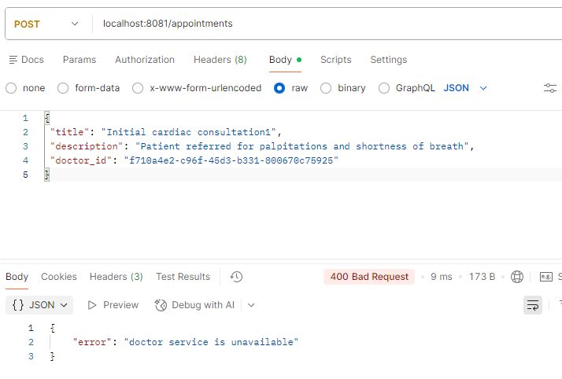
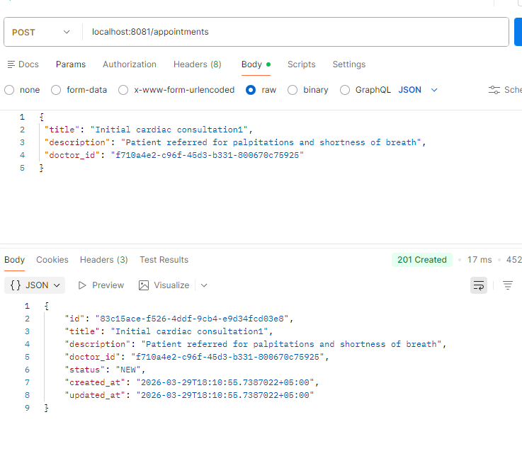
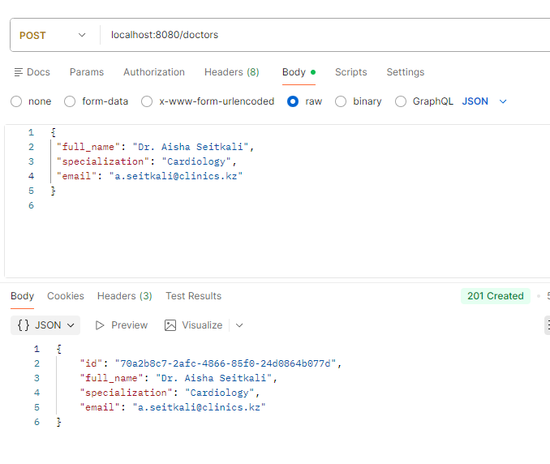
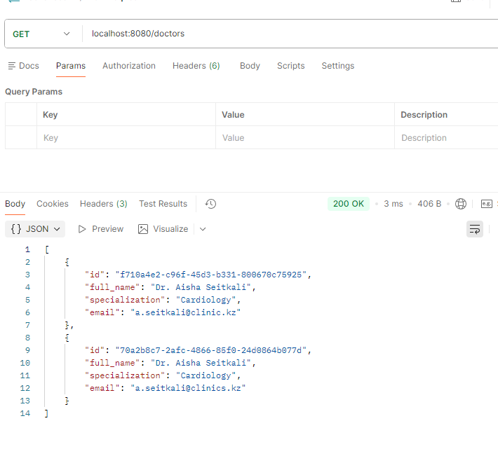
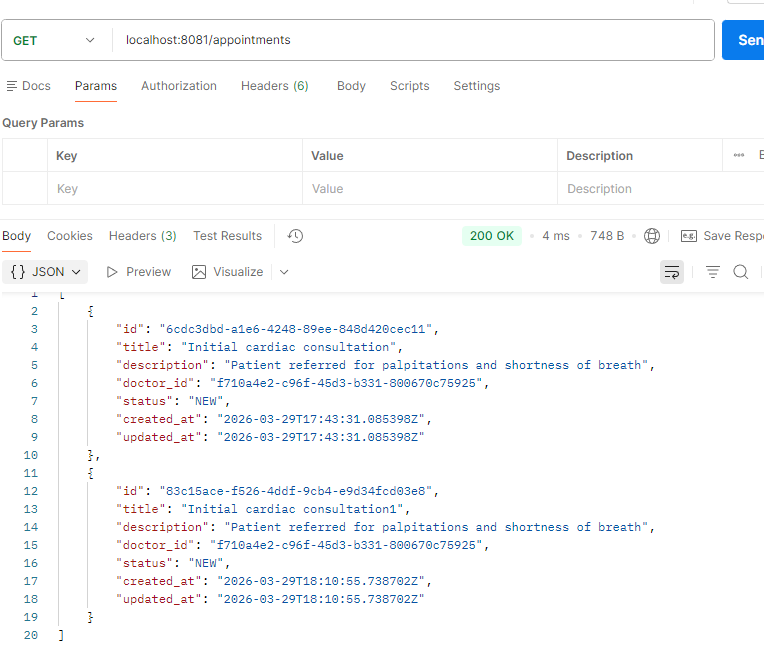
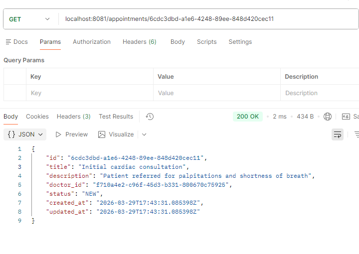
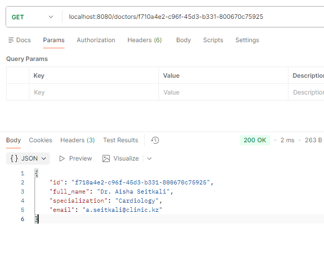
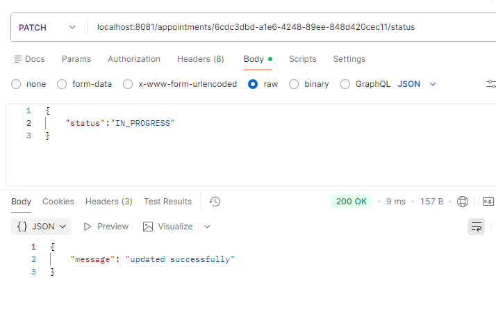

#  Medical Scheduling Platform

##  Project Overview

This project implements a simple medical scheduling platform using a **microservices architecture in Go**.
It consists of two independent services:

* **Doctor Service** – manages doctor profiles
* **Appointment Service** – manages appointments and validates doctor existence

The system is structured using **Clean Architecture principles** to ensure separation of concerns, scalability, and maintainability.

---

##  Service Responsibilities

###  Doctor Service

* Manages doctor data
* Provides REST endpoints:

    * `POST /doctors`
    * `GET /doctors/{id}`
    * `GET /doctors`
* Enforces:

    * Required fields (full name, email)
    * Unique email constraint

---

###  Appointment Service

* Manages appointment data
* Provides REST endpoints:

    * `POST /appointments`
    * `GET /appointments/{id}`
    * `GET /appointments`
    * `PATCH /appointments/{id}/status`
* Enforces:

    * Doctor existence via Doctor Service (REST call)
    * Valid status values (`new`, `in_progress`, `done`)
    * Business rule: cannot transition from `done` → `new`

---

## Folder Structure & Dependency Flow

Each service follows Clean Architecture:

```
internal/
├── model        → domain entities
├── usecase      → business logic
├── repository   → data access
├── transport    → HTTP handlers
├── client       → external service calls (Appointment Service only)
└── app          → dependency wiring
```

###  Dependency Direction

```
Handler → Usecase → Repository
                ↘
                 Client (Doctor Service)
```

* Handlers depend on usecases
* Usecases depend on interfaces (repository, client)
* Repositories implement database logic
* No layer depends on outer layers

---

##  Inter-Service Communication

The Appointment Service communicates with the Doctor Service via REST:

```
GET /doctors/{id}
```

### Flow:

1. User creates appointment
2. Appointment Service calls Doctor Service
3. If doctor exists → appointment created
4. If not → error returned

### HTTP Contract:

* `200 OK` → doctor exists
* `400 Bad request` → doctor does not exist
* Network error → service unavailable

---

## ️ How to Run the Project

### 1. Clone the repository

```
git clone https://github.com/silence99999/assignment 1
cd assignment 1
```

---

### 2. Setup databases

Create two separate databases:

```
doctor_db
appointment_db
```

Run migrations (Goose):

```
goose -dir migrations postgres "<connection_string>" up
```

---

### 3. Configure environment variables

Create `.env` files for each service:

```
DOCTOR_SERVICE_URL=http://localhost:8080
PORT=8081
```

---

### 4. Run Doctor Service

```
cd doctor-service
go run ./cmd/doctor
```

Runs on: `http://localhost:8080`

---

### 5. Run Appointment Service

```
cd appointment-service
go run ./cmd/appointment
```

Runs on: `http://localhost:8081`

---

##  Why a Shared Database Was Not Used

Each service owns its own database to ensure **data ownership and service independence**.

Using a shared database would:

* Break service boundaries
* Create tight coupling
* Turn the system into a distributed monolith

Instead, the Appointment Service validates doctor data via REST, preserving proper microservice architecture.

---

##  Failure Scenario

If the Doctor Service is unavailable:

* Appointment creation/update is **rejected**
* A clear error message is returned:

  ```
  "doctor service unavailable"
  ```
* The failure is logged internally

---

###  Resilience Considerations (Production)

In a production system, additional patterns would be used:

* **Timeouts** → prevent hanging requests
* **Retries** → handle temporary failures
* **Circuit Breaker** → avoid cascading failures

These improvements ensure system stability at scale.

---

### Postman examples


create appointment when doctor service is down


successfull creation of appointment


doctor creation


get all doctors


get all appointments



get by id


update appointment status

##  Summary

This project demonstrates:

* Clean Architecture implementation
* Proper microservice decomposition
* REST-based inter-service communication
* Separation of concerns and dependency inversion
* Handling of real-world failure scenarios

---
